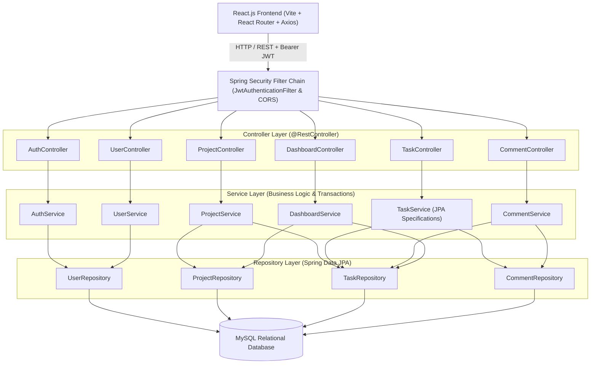
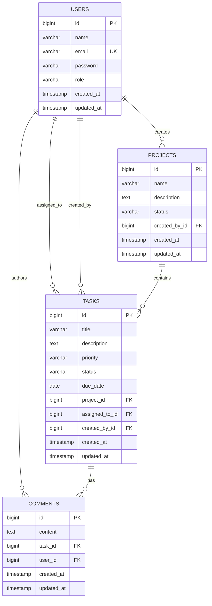

# Task Management & Collaboration Platform

An enterprise-grade, full-stack Task Management & Collaboration Platform built with **Java 17+**, **Spring Boot 3+**, **Spring Security 6**, **JJWT**, **MySQL**, and **React.js**. Designed following strict **Clean Layered Architecture**, **SOLID principles**, **Object-Oriented Design**, and **Role-Based Access Control (RBAC)**.

> [!NOTE]
> This project is engineered for showcase in the **Salesforce Associate Member of Technical Staff (AMTS) Software Engineer** interview process. It demonstrates robust software engineering fundamentals: REST API design, relational database normalization, stateless JWT security, Jakarta Bean Validation, centralized error handling, and automated testing with JUnit 5, Mockito, and MockMvc.

---

## Architecture Diagram



---

## Features

### 1. User Authentication & Authorization (RBAC)
- **Registration & Login**: Secure user registration and authentication with email and BCrypt password hashing.
- **Stateless JWT Security**: Industry-standard HMAC-SHA256 tokens issued upon login with configurable expiration.
- **Role-Based Access Control (RBAC)**:
  - **`ADMIN`**: Full administrative clearance to manage users, create/update/delete any project, manage all tasks, and moderate discussion comments.
  - **`MANAGER`**: Create projects, assign tasks to engineers, track team delivery, and participate in discussions.
  - **`USER`**: View assigned tasks, transition task workflow statuses (e.g. `TODO` → `IN_PROGRESS` → `COMPLETED`), and collaborate via comments.
- **Credential Hygiene**: Strict separation of concerns; passwords are encrypted with BCrypt and **never returned in API responses**.

### 2. Project Management
- **Full Project Lifecycle**: Create, view, update, and delete projects.
- **Progress Aggregation**: Dynamic computation of total tasks and completion percentage per project.
- **Cascade Governance**: Projects safely track creator ownership and task associations.

### 3. Task Management & Dynamic Filtering
- **Task Workflow**: Tracks `title`, `description`, `priority` (`LOW`, `MEDIUM`, `HIGH`, `CRITICAL`), `status` (`TODO`, `IN_PROGRESS`, `COMPLETED`, `BLOCKED`), and `dueDate`.
- **Dynamic JPA Specifications**: Multi-criteria REST filtering supporting composite filters:
  - `GET /api/tasks?status=IN_PROGRESS&priority=HIGH`
  - `GET /api/tasks?assignee={id}&project={id}`
- **Pagination & Sorting**: Paginated responses with sorting (`page`, `size`, `sortBy`, `sortDir`) to prevent memory exhaustion and optimize query performance.
- **Granular Status Transition**: Dedicated `PATCH /api/tasks/{id}/status` endpoint enabling assigned engineers to update their workflow status.

### 4. Real-Time Task Comments & Collaboration
- **Task Discussions**: Threaded comments on tasks for progress notes, blockers, and code review links.
- **Author Authorization**: Only the comment author or an `ADMIN` can delete a comment.

### 5. Workspace Dashboard
- **KPI Metrics**: Real-time aggregated statistics:
  - Total Projects
  - Total Tasks
  - Completed Tasks
  - In-Progress Tasks
  - Pending & Blocked Tasks

---

## Tech Stack

| Layer | Technologies |
|---|---|
| **Backend** | Java 17+, Spring Boot 3.3, Spring Web, Spring Data JPA, Hibernate, Spring Security 6, JJWT 0.12, Maven |
| **Frontend** | React 18, JavaScript (ES6+), React Router 6, Axios, Lucide React, Vite, Custom SLDS-inspired CSS |
| **Database** | MySQL 8.0, Normalized Relational Schema, B-Tree Indexes, Foreign Key Constraints |
| **Testing** | JUnit 5, Mockito, MockMvc, AssertJ, In-Memory H2 (Test Profile) |
| **Documentation & Tooling** | OpenAPI 3 (SpringDoc Swagger UI), Postman v2.1 Collection |

---

## Entity-Relationship Diagram (ERD)



---

## Project Structure

```
Task Management Platform/
├── .env.example                               # Root environment variable template
├── .gitignore                                 # Git exclusions for secrets, targets, node_modules
├── README.md                                  # Complete architecture & run guide
├── postman/
│   └── Task_Management_Platform.postman_collection.json # Postman test collection with auto-JWT
├── backend/
│   ├── pom.xml                                # Maven build configuration
│   ├── mvnw.cmd                               # Windows Maven wrapper
│   ├── .env.example                           # Backend environment template
│   └── src/
│       ├── main/
│       │   ├── java/com/taskmanagement/
│       │   │   ├── TaskManagementApplication.java # Spring Boot application entry point
│       │   │   ├── config/
│       │   │   │   ├── DataInitializer.java   # Auto-seeds demo accounts on first launch
│       │   │   │   ├── OpenApiConfig.java     # Swagger 3 & JWT Bearer configuration
│       │   │   │   └── SecurityConfig.java    # Spring Security 6 & CORS configuration
│       │   │   ├── controller/
│       │   │   │   ├── AuthController.java    # Registration, login, /me
│       │   │   │   ├── CommentController.java # Comment CRUD
│       │   │   │   ├── DashboardController.java # Aggregated KPI metrics
│       │   │   │   ├── ProjectController.java # Project CRUD & authorization
│       │   │   │   ├── TaskController.java    # Task CRUD, filters, status patch
│       │   │   │   └── UserController.java    # User directory listing
│       │   │   ├── dto/
│       │   │   │   ├── request/               # Validated request payloads
│       │   │   │   └── response/              # Data Transfer Objects (No entity leakage)
│       │   │   ├── entity/                    # JPA Entities & Enums (Role, Status, Priority)
│       │   │   ├── exception/                 # Centralized GlobalExceptionHandler & custom exceptions
│       │   │   ├── mapper/                    # Entity <-> DTO mappers
│       │   │   ├── repository/                # Spring Data JPA repositories & Specifications
│       │   │   ├── security/                  # CustomUserDetails, JWT filter, EntryPoint, Provider
│       │   │   ├── service/                   # Core transactional business logic
│       │   │   └── util/                      # SecurityContext helper utilities
│       │   └── resources/
│       │       ├── application.properties     # Config reading system environment variables
│       │       └── schema.sql                 # Normalized DDL script with indexes
│       └── test/
│           ├── java/com/taskmanagement/
│           │   ├── controller/                # MockMvc tests (Auth, Project, Task)
│           │   ├── security/                  # JJWT token generation & tampering tests
│           │   └── service/                   # JUnit 5 & Mockito business logic tests
│           └── resources/
│               ├── application.properties     # Isolated in-memory H2 test configuration
│               └── mockito-extensions/        # Subclass mock-maker for Java 21+ compatibility
└── frontend/
    ├── package.json                           # React, Axios, React Router dependencies
    ├── vite.config.js                         # Vite dev server & proxy settings
    ├── .env.example                           # Frontend API base URL template
    ├── index.html                             # Single Page Application HTML shell
    └── src/
        ├── api/axiosClient.js                 # Centralized Axios with JWT interceptors
        ├── context/AuthContext.jsx            # React Auth context & session management
        ├── components/                        # Reusable UI components (Navbar, Sidebar, Badges, Modal)
        ├── pages/                             # Login, Register, Dashboard, Projects, Tasks, Profile
        ├── App.jsx                            # Route definitions & protected routes
        ├── main.jsx                           # React DOM mount point
        └── index.css                          # Enterprise design system stylesheet
```

---

## REST API Catalog

All endpoints except `/api/auth/**` require the `Authorization: Bearer <token>` header.

### Authentication Endpoints
| Method | Endpoint | Description | Access |
|---|---|---|---|
| `POST` | `/api/auth/register` | Register a new user account | Public |
| `POST` | `/api/auth/login` | Authenticate and issue JWT Bearer token | Public |
| `GET` | `/api/auth/me` | Fetch authenticated user profile | Authenticated |

### Project Endpoints
| Method | Endpoint | Description | Access |
|---|---|---|---|
| `GET` | `/api/projects` | List all projects with task statistics | Authenticated |
| `POST` | `/api/projects` | Create a new project | `ADMIN`, `MANAGER` |
| `GET` | `/api/projects/{id}` | Get project details by ID | Authenticated |
| `PUT` | `/api/projects/{id}` | Update project name, description, status | `ADMIN`, `MANAGER` |
| `DELETE` | `/api/projects/{id}` | Permanently delete project | `ADMIN` |

### Task Endpoints
| Method | Endpoint | Description | Access |
|---|---|---|---|
| `GET` | `/api/tasks` | Filter tasks (`status`, `priority`, `assignee`, `project`, `page`, `size`) | Authenticated |
| `POST` | `/api/tasks` | Create task with project & assignee | `ADMIN`, `MANAGER` |
| `GET` | `/api/tasks/{id}` | Get task details and comment count | Authenticated |
| `PUT` | `/api/tasks/{id}` | Update task details | `ADMIN`, `MANAGER` |
| `PATCH`| `/api/tasks/{id}/status` | Update workflow status (`TODO`, `IN_PROGRESS`, `COMPLETED`, `BLOCKED`) | `ADMIN`, `MANAGER`, Assignee |
| `DELETE`| `/api/tasks/{id}` | Delete task | `ADMIN`, `MANAGER` |

### Comment Endpoints
| Method | Endpoint | Description | Access |
|---|---|---|---|
| `GET` | `/api/tasks/{taskId}/comments` | Get all comments for a task | Authenticated |
| `POST` | `/api/tasks/{taskId}/comments` | Add comment to a task discussion | Authenticated |
| `DELETE`| `/api/comments/{commentId}` | Delete comment | Author or `ADMIN` |

### Dashboard & Users Endpoints
| Method | Endpoint | Description | Access |
|---|---|---|---|
| `GET` | `/api/dashboard/metrics` | Retrieve workspace KPIs | Authenticated |
| `GET` | `/api/users` | List users for task assignments | Authenticated |
| `GET` | `/api/users/{id}` | Get user details by ID | Authenticated |

---

## Interactive API Documentation (Swagger / OpenAPI)

Once the backend is running, access the interactive Swagger 3 UI at:
```
http://localhost:8080/swagger-ui.html
```
Click **Authorize** in the upper right corner and enter your Bearer token to test protected endpoints directly within your browser.

---

## Environment Variables & Security Hygiene

> [!IMPORTANT]
> **Zero Hardcoded Credentials**: Passwords, database usernames, and JWT secrets are never hardcoded in Java source files. They are injected at runtime via environment variables.

### Backend Configuration Reference
| Variable | Description | Default Local Fallback |
|---|---|---|
| `DATABASE_URL` | MySQL JDBC connection string | `jdbc:mysql://localhost:3306/task_management` |
| `DATABASE_USERNAME` | MySQL database username | `root` |
| `DATABASE_PASSWORD` | MySQL database password | `root` |
| `JWT_SECRET` | 256-bit secret key for HMAC-SHA | Configured via `.env` |
| `JWT_EXPIRATION_MS`| JWT validity in milliseconds | `86400000` (24 hours) |
| `PORT` | Spring Boot HTTP port | `8080` |

### Frontend Configuration Reference
| Variable | Description | Default Local Fallback |
|---|---|---|
| `VITE_API_BASE_URL` | Backend REST API base URL | `http://localhost:8080/api` |

---

## Local Setup (Native / No Docker)

### Prerequisites
1. **Java 17 or higher** (`java -version`)
2. **Maven 3.8+** (or use the included `mvn` / `mvnw.cmd`)
3. **MySQL Server 8.0+**
4. **Node.js 18+ and npm** (`node -v`, `npm -v`)

---

### Step 1: Database Setup
1. Open your MySQL client (MySQL Workbench, MySQL Shell, or command line):
   ```sql
   CREATE DATABASE IF NOT EXISTS task_management;
   ```

---

### Step 2: Configure Environment Variables
1. In the project root, copy `.env.example` to `.env`:
   ```bash
   cp .env.example .env
   ```
2. Open `.env` and set your local MySQL credentials:
   ```properties
   DATABASE_URL=jdbc:mysql://localhost:3306/task_management?useSSL=false&serverTimezone=UTC&allowPublicKeyRetrieval=true&createDatabaseIfNotExist=true
   DATABASE_USERNAME=root
   DATABASE_PASSWORD=your_actual_mysql_password
   JWT_SECRET=dGhpcy1pcy1hLXNlY3VyZS0yNTYtYml0LXNlY3JldC1rZXktZm9yLXRhc2stbWFuYWdlbWVudC1wbGF0Zm9ybQ==
   ```

---

### Step 3: Run Backend (Spring Boot)
1. Open a terminal in the `backend/` directory:
   ```bash
   # Run automated test suite
   mvn test

   # Start the Spring Boot application
   mvn spring-boot:run
   ```
2. The backend will start on `http://localhost:8080`.
3. On first startup, the database schema is automatically verified/created, and `DataInitializer` seeds demo accounts:
   - **Admin**: `admin@example.com` / `Password123!`
   - **Manager**: `manager@example.com` / `Password123!`
   - **User**: `user@example.com` / `Password123!`

---

### Step 4: Run Frontend (React Vite)
1. Open a second terminal in the `frontend/` directory:
   ```bash
   npm.cmd install
   npm.cmd run dev
   ```
2. Open your browser and navigate to:
   ```
   http://localhost:5173
   ```
3. Use the **Quick Demo Logins** on the login page to immediately sign in as **Admin**, **Manager**, or **Developer**.

---

## Automated Testing Suite

The application includes 36 automated unit and integration tests using **JUnit 5**, **Mockito**, and **MockMvc**:

```bash
mvn test -f backend/pom.xml
```

### Test Coverage Highlights:
- **`AuthServiceTest`**: User registration, password hashing verification, duplicate email rejection (`ResourceAlreadyExistsException`), and authentication credential verification.
- **`ProjectServiceTest`**: Project creation, retrieval, task completion metrics aggregation, and role-restricted project deletion.
- **`TaskServiceTest`**: Task creation with assignee validation, dynamic filtering via JPA Specifications, status transition authorization, and task deletion.
- **`CommentServiceTest`**: Adding comments to tasks, listing comments, author-only deletion permissions, and admin override.
- **`AuthControllerTest`**: MockMvc HTTP testing for `/api/auth/register` (testing Bean Validation annotations like `@Email` and password size constraints) and `/api/auth/login`.
- **`ProjectControllerTest`**: MockMvc HTTP testing for project endpoints, validating response schemas and 404 error envelopes.
- **`TaskControllerTest`**: MockMvc testing for task query parameters, status patch updates, and input validation.
- **`JwtTokenProviderTest`**: Cryptographic HMAC-SHA256 token generation, signature validation, expiration handling, and tampering rejection.

---

## Postman Collection

A complete Postman collection is included in:
```
postman/Task_Management_Platform.postman_collection.json
```

### How to Import & Use:
1. Open Postman and click **Import**.
2. Select `postman/Task_Management_Platform.postman_collection.json`.
3. Open the **Authentication** folder and send **Login User**.
4. The embedded Postman test script automatically extracts `response.token` and stores it into `{{bearer_token}}`.
5. All other requests in Projects, Tasks, and Comments automatically inherit `Authorization: Bearer {{bearer_token}}`.

---

## Future Improvements

- [ ] **Email Notifications**: Integration with Spring Boot Mail (JavaMailSender) to notify developers when assigned a critical task.
- [ ] **Activity Audit Trail**: Event logging table recording timestamped changes to task status and project scope.
- [ ] **WebSocket Live Updates**: Spring STOMP/WebSocket integration for real-time comment and task status push updates.
- [ ] **Subtasks & Dependencies**: Support for parent-child task breakdowns and blocker dependency graphs.

---

## Resume Description (Salesforce AMTS Candidate)

- **Engineered a full-stack Task Management & Collaboration Platform** utilizing **Java 17, Spring Boot 3, Hibernate, and MySQL**, adopting a Clean Layered Architecture with DTOs, mappers, and custom `@RestControllerAdvice` exception handling.
- **Implemented stateless authentication and Role-Based Access Control (RBAC)** using **Spring Security 6, JJWT, and BCrypt**, restricting endpoint capabilities across Admin, Manager, and User tiers with dynamic multi-criteria JPA query filtering.
- **Developed a responsive React.js SPA** with centralized Axios interceptors, protected routing, and real-time dashboard KPIs, backed by **36 automated unit and integration tests** using **JUnit 5, Mockito, and MockMvc**.
